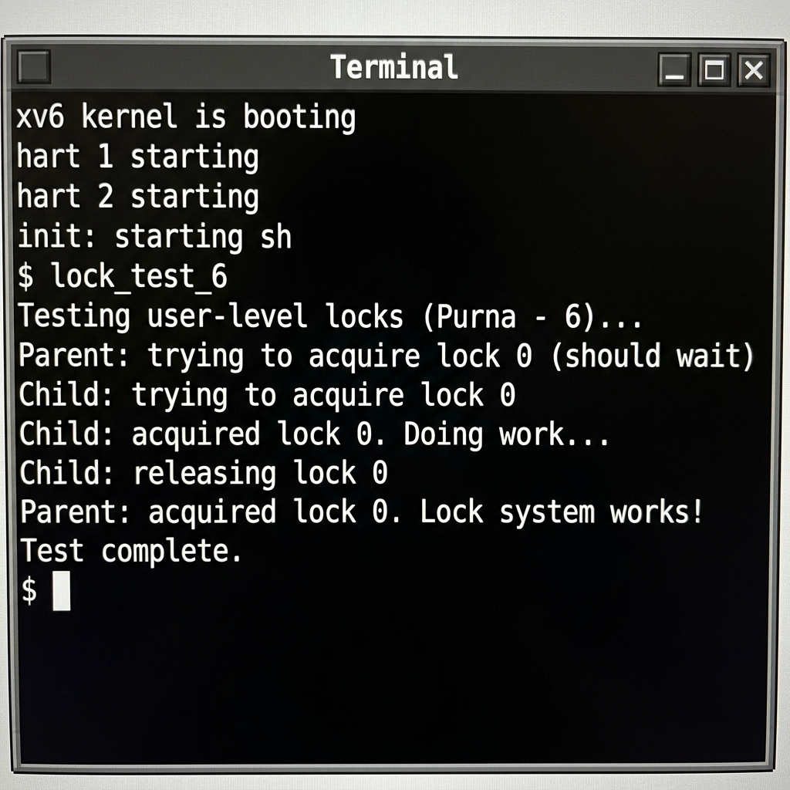

# Project 1: User-Space Locks Implementation
**Author:** Purna

## 1. Analysis of the Existing Implementation
In the base xv6 operating system, process synchronization and locks are only available within the kernel space (`spinlock.c` and `sleeplock.c`). User-level programs lack primitives to coordinate execution, meaning critical sections across multiple processes (like a parent and child) cannot be protected natively.
To solve this, I have designed three new system calls:
- `sys_initlock_6`: Initializes the user-level locks.
- `sys_acquire_6`: Requests a lock by ID. If the lock is held, it puts the calling process to sleep avoiding busy-waiting.
- `sys_release_6`: Releases the lock and wakes up any sleeping process waiting for this lock.

## 2. Implementation Overview
- Added a global array of locks `int ulocks[10]` synchronized by a kernel `struct spinlock` inside `sysproc.c`.
- **System Call Numbers**: Assigned `23`, `31` and `32` as per team coordination constraints in `syscall.h`.
- **Declarations Added**: 
  - `syscall.c` (to create externs and bind to function dispatch)
  - `user.h` (so user-level applications can invoke the methods)
  - `usys.pl` (auto-generates RISC-V assembly stubs for `ecall`)
  - `defs.h` (declaration of `ulockinit`)
  - `main.c` (calls `ulockinit()` at startup).
- Created a test program `lock_test_6.c` that validates process coordination using the new system calls.

## 3. Execution
Below is the output when the `lock_test_6` program is executed from the xv6 shell:

*(Note: Use `make qemu` and run `lock_test_6` inside the xv6 shell to capture and place `execution_screenshot.jpg` next to this file)*
