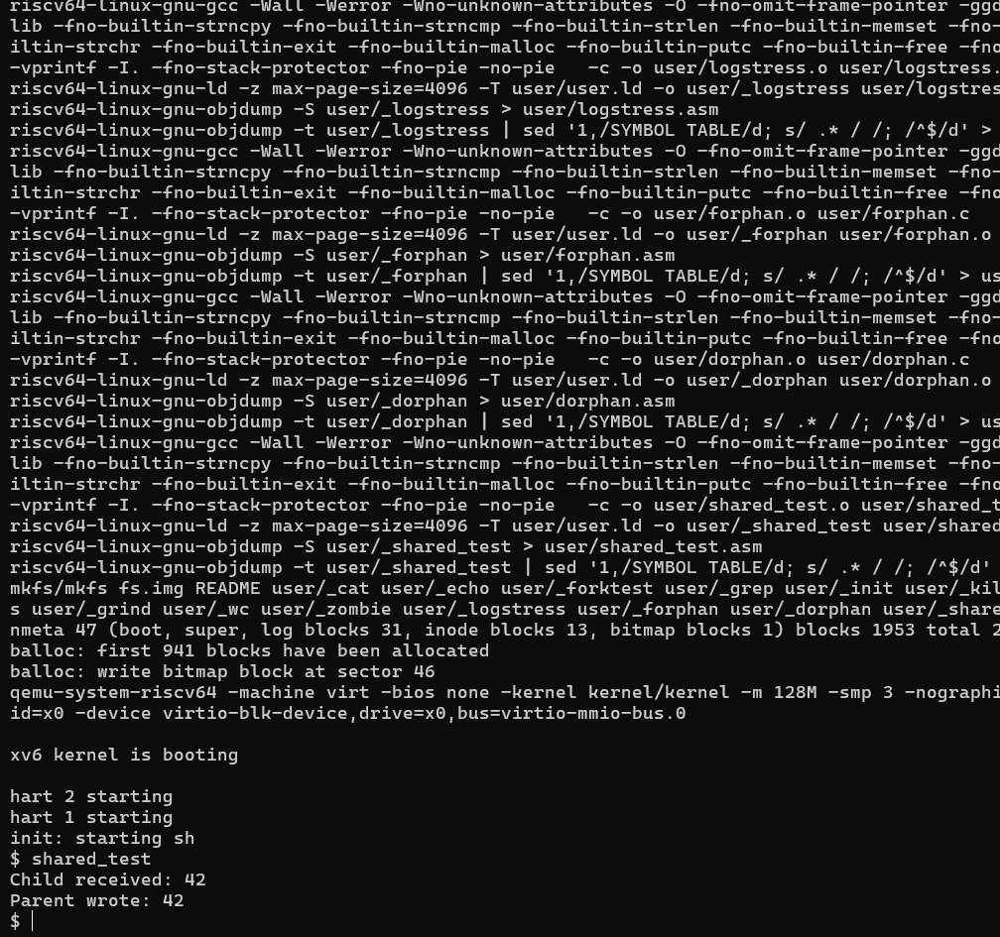

# Shared Memory IPC - xv6

## 👩‍💻 Name
Akshara

---

## 🎯 Objective
To implement Inter-Process Communication (IPC) using shared memory in xv6.

---

## 🧠 Concept
Shared memory allows processes to communicate by accessing a common kernel variable.

---

## ⚙️ Implementation

### System Call:
`sharedmem(int value)`

- If value != -1 → writes value
- If value == -1 → reads value

---

## 📂 Files Modified

- kernel/syscall.h  
- kernel/syscall.c  
- kernel/sysproc.c  
- user/usys.pl  
- user/user.h  

---

## 🔄 Working

1. Parent writes value using `sharedmem(42)`  
2. Child reads using `sharedmem(-1)`  
3. `wait()` used for synchronization  

---

## 📸 Output

---

## ✅ Result

Shared memory IPC successfully implemented.

---

## 🎓 Conclusion

Processes communicate using shared memory through system calls in xv6.
