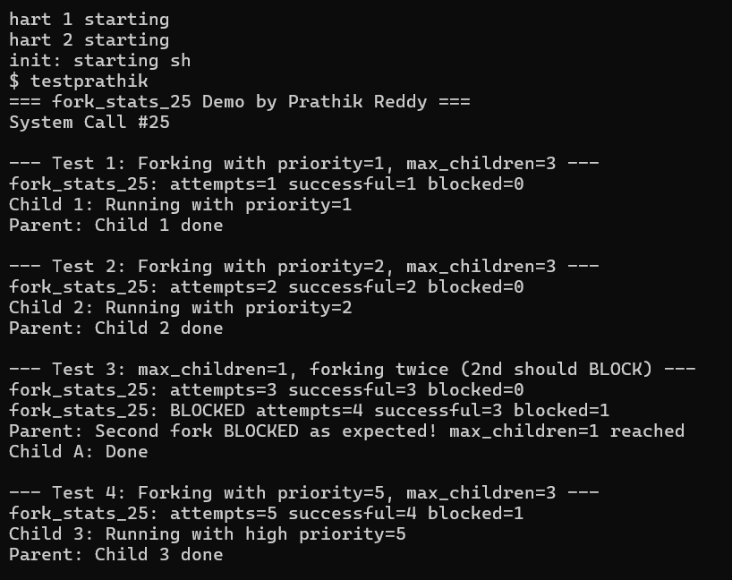

# 🔹 Project 1: System Call Customization in xv6

## Overview - 24JE0716

This project focuses on extending the _xv6_ operating system by implementing a new custom system call that enhances the traditional process creation mechanism. The primary objective is to design and implement `fork_stats_25`, a system call that extends `fork()` with priority assignment, child process limiting, and creation statistics tracking.

---

## System Call Implemented

### `fork_stats_25(int priority, int max_children)`

* Extends the traditional `fork()` system call with additional control.
* Assigns a **priority level** to the newly created child process.
* Limits the **maximum number of child processes** a process can create.
* Tracks **process creation statistics** including attempts, successful forks, and blocked forks.

---

## Design and Implementation

### 🔹 Priority Field in Process Structure

A new `priority` field was added to the `proc` struct in `kernel/proc.h` to store the priority assigned to each process:

```c
int priority;   // Priority assigned via fork_stats_25
```

---

### 🔹 Fork Statistics Tracking

A statistics structure is maintained inside the kernel to track all fork activity:

```c
struct fork_stats {
  int attempts;
  int successful;
  int blocked;
};

static struct fork_stats fstats_25 = {0, 0, 0};
```

* `attempts` → total number of times `fork_stats_25` was called
* `successful` → number of child processes successfully created
* `blocked` → number of fork requests that were denied

---

### 🔹 Child Count Checking

Before creating a new child, the system call iterates through the process table to count existing children of the calling process:

```c
struct proc *pp;
extern struct proc proc[];
for(pp = proc; pp < &proc[NPROC]; pp++){
    acquire(&pp->lock);
    if(pp->parent == p && pp->state != UNUSED){
        children++;
    }
    release(&pp->lock);
}
```

If the count reaches `max_children`, the fork is blocked and `-1` is returned.

---

### 🔹 Full System Call Implementation

```c
uint64
sys_fork_stats_25(void)
{
  int priority, max_children;
  struct proc *p = myproc();
  int children = 0;

  argint(0, &priority);
  argint(1, &max_children);

  fstats_25.attempts++;

  struct proc *pp;
  extern struct proc proc[];
  for(pp = proc; pp < &proc[NPROC]; pp++){
    acquire(&pp->lock);
    if(pp->parent == p && pp->state != UNUSED){
      children++;
    }
    release(&pp->lock);
  }

  if(children >= max_children){
    fstats_25.blocked++;
    printf("fork_stats_25: BLOCKED attempts=%d successful=%d blocked=%d\n",
           fstats_25.attempts, fstats_25.successful, fstats_25.blocked);
    return -1;
  }

  int pid = kfork();

  if(pid < 0){
    fstats_25.blocked++;
    printf("fork_stats_25: FAILED attempts=%d successful=%d blocked=%d\n",
           fstats_25.attempts, fstats_25.successful, fstats_25.blocked);
    return -1;
  }

  if(pid == 0){
    myproc()->priority = priority;
  }

  fstats_25.successful++;
  printf("fork_stats_25: attempts=%d successful=%d blocked=%d\n",
         fstats_25.attempts, fstats_25.successful, fstats_25.blocked);

  return pid;
}
```

---

## Execution Flow

1. User program calls `fork_stats_25(priority, max_children)`
2. Kernel increments attempt counter
3. Kernel counts existing children of calling process
4. If children >= max_children → fork is **blocked**, returns `-1`
5. Otherwise → `kfork()` is called to create child process
6. Child process is assigned the given priority
7. Statistics are updated and printed
8. Child PID is returned to parent, `0` to child

---

## File Changes

### 🔹 Kernel Files

#### `kernel/proc.h`
- Added `priority` field to the `proc` struct

```c
int priority;   // Priority assigned via fork_stats_25
```

---

#### `kernel/syscall.h`
- Registered syscall number 25

```c
#define SYS_fork_stats_25  25
```

---

#### `kernel/syscall.c`
- Added extern declaration and registered in syscall table

```c
extern uint64 sys_fork_stats_25(void);

static uint64 (*syscalls[])(void) = {
  ...
  [SYS_fork_stats_25]  sys_fork_stats_25,
};
```

---

#### `kernel/sysproc.c`
- Implemented `sys_fork_stats_25()` with full logic including:
  - Argument reading
  - Child counting
  - Blocking logic
  - Statistics tracking
  - Priority assignment

---

### 🔹 User Space Files

#### `user/user.h`
- Added function declaration:

```c
int fork_stats_25(int priority, int max_children);
```

#### `user/usys.pl`
- Added syscall stub entry:

```perl
entry("fork_stats_25");
```

#### `user/testprathik.c`
- Created user-level test program to demonstrate all features

---

## Testing

A user program `testprathik.c` was created to demonstrate the system call:

```c
#include "kernel/types.h"
#include "kernel/stat.h"
#include "user/user.h"

int main() {
  printf("=== fork_stats_25 Demo by Prathik Reddy ===\n");
  printf("System Call #25\n\n");

  int pid1, pid2, pid3;

  // Test 1: Normal fork with priority 1, max 3 children
  printf("--- Test 1: Forking with priority=1, max_children=3 ---\n");
  pid1 = fork_stats_25(1, 3);
  if(pid1 == 0){
    printf("Child 1: Running with priority=1\n");
    exit(0);
  }
  wait(0);
  printf("Parent: Child 1 done\n\n");

  // Test 2: Fork with priority 2, max 3 children
  printf("--- Test 2: Forking with priority=2, max_children=3 ---\n");
  pid2 = fork_stats_25(2, 3);
  if(pid2 == 0){
    printf("Child 2: Running with priority=2\n");
    exit(0);
  }
  wait(0);
  printf("Parent: Child 2 done\n\n");

  // Test 3: Fork two children simultaneously, max=1 (second should block)
  printf("--- Test 3: max_children=1, forking twice (2nd should BLOCK) ---\n");
  pid1 = fork_stats_25(1, 1);
  if(pid1 == 0){
    for(volatile int i = 0; i < 10000000; i++);
    printf("Child A: Done\n");
    exit(0);
  }
  pid2 = fork_stats_25(1, 1);
  if(pid2 < 0){
    printf("Parent: Second fork BLOCKED as expected! max_children=1 reached\n");
  } else if(pid2 == 0){
    printf("Child B: Created (unexpected)\n");
    exit(0);
  } else {
    wait(0);
  }
  wait(0);

  // Test 4: Fork with high priority
  printf("\n--- Test 4: Forking with priority=5, max_children=3 ---\n");
  pid3 = fork_stats_25(5, 3);
  if(pid3 == 0){
    printf("Child 3: Running with high priority=5\n");
    exit(0);
  }
  wait(0);
  printf("Parent: Child 3 done\n");

  printf("\n=== Demo Complete ===\n");
  exit(0);
}
```

---

## Output / Results

### Execution Screenshot



---

### Expected Output

```
=== fork_stats_25 Demo by Prathik Reddy ===
System Call #25

--- Test 1: Forking with priority=1, max_children=3 ---
fork_stats_25: attempts=1 successful=1 blocked=0
Child 1: Running with priority=1
Parent: Child 1 done

--- Test 2: Forking with priority=2, max_children=3 ---
fork_stats_25: attempts=2 successful=2 blocked=0
Child 2: Running with priority=2
Parent: Child 2 done

--- Test 3: max_children=1, forking twice (2nd should BLOCK) ---
fork_stats_25: attempts=3 successful=3 blocked=0
fork_stats_25: BLOCKED attempts=4 successful=3 blocked=1
Parent: Second fork BLOCKED as expected! max_children=1 reached
Child A: Done

--- Test 4: Forking with priority=5, max_children=3 ---
fork_stats_25: attempts=5 successful=4 blocked=1
Child 3: Running with high priority=5
Parent: Child 3 done

=== Demo Complete ===
```

---

## Results Summary

* ✅ Successful forks with different priority levels
* ✅ Correct blocking when `max_children` limit is reached
* ✅ Accurate statistics tracking (attempts, successful, blocked)
* ✅ Priority correctly assigned to child processes
* ✅ Clean output with no data corruption

---

## Limitations

* Priority is stored but not yet used by the xv6 scheduler
* Statistics reset when xv6 is rebooted
* Only integer priority levels supported

---

## Future Enhancements

* Integrate priority into the xv6 scheduler for true priority-based scheduling
* Persist fork statistics across process lifetimes
* Add a separate `get_fork_stats()` syscall to retrieve stats from user space
* Support priority inheritance for nested child processes

---

## Concepts Learned

* System call implementation in xv6
* Kernel and user space interaction
* Process creation and management
* Process table traversal
* Spinlocks and mutual exclusion
* Priority-based process management
* Statistics tracking at kernel level

---
