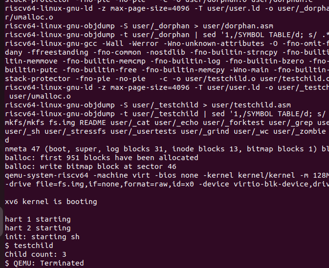

# Project 1: getchildcount System Call

**Author:** Sai Teja

---

## 1. Analysis of the Existing Implementation

In the base xv6 operating system, there is no direct system call to determine how many child processes a process has created.

Each process maintains a pointer to its parent, but there is no utility provided to count child processes from the user space.

---

## 2. Objective

To implement a new system call `getchildcount()` that returns the number of child processes of the calling process.

---

## 3. Implementation Overview

The system call works by iterating through the process table (`proc[]`) and counting all processes whose `parent` matches the current process.

### Key Logic:

- Get current process using `myproc()`
- Traverse all processes
- Compare `pp->parent == current process`
- Increment count

---

## 4. System Call Details

**System Call Name:** `getchildcount`  
**Return Type:** Integer  
**Description:** Returns number of child processes

---

## 5. Testing

A user program was written which creates multiple child processes using `fork()` and then calls `getchildcount()`.

---

## 6. Output

Example output:  Child count: 3

---

## 7. Conclusion

The system call successfully counts the number of child processes by scanning the process table and checking parent-child relationships.

---

## 8. Execution Screenshot

 
