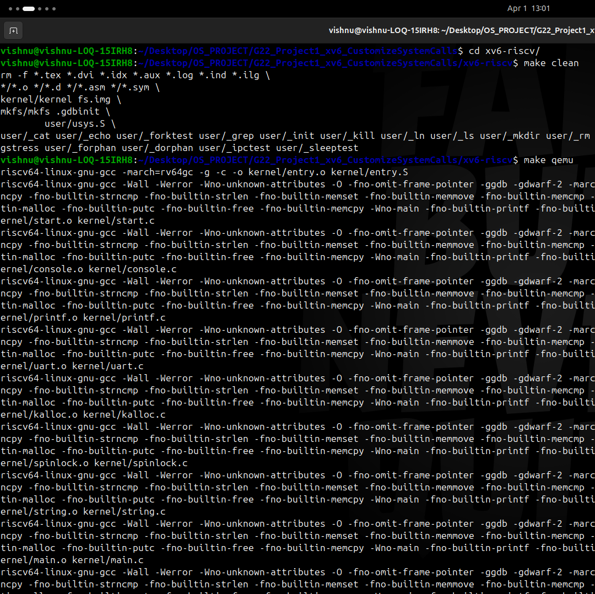
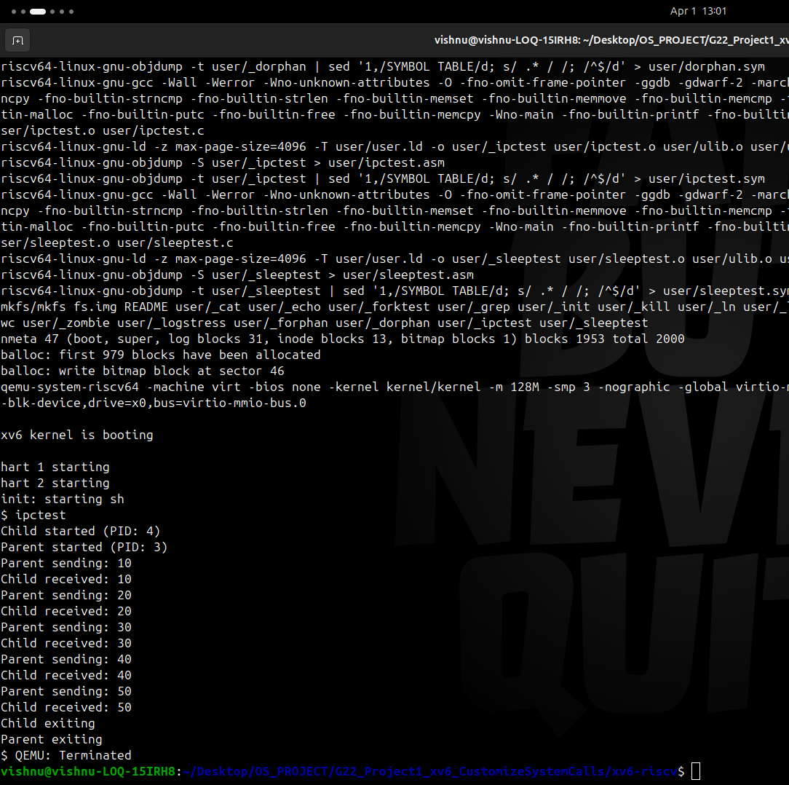

# 🔹 Project 1: System Call Customization in xv6

##  Overview - 24JE0714

This project focuses on extending the _xv6_ operating system by implementing new system calls and understanding the interaction between user space and kernel space.
The primary objective is to design and implement a simple Inter-Process Communication (IPC) mechanism using message passing, along with proper synchronization and process blocking techniques.

---

##  System Calls Implemented

### 1. `send(int value)`

* Sends an integer message from one process to another.
* Stores the message in a kernel-managed buffer.
* Blocks if the buffer is already full.

---

### 2. `recv(void)`

* Receives a message from the kernel buffer.
* Returns the received integer value.
* Blocks if no message is available.

---

### 3. `sleep(int ticks)`

* Suspends the execution of a process for a specified number of clock ticks.
* Uses the global timer (`ticks`) and scheduler.
* Process is resumed automatically after the required time.
* sleep( n ) = n X 10 milliseconds.
---

##  Design and Implementation

### 🔹 Message Passing (IPC)

A single-slot message box is implemented inside the kernel:

```c
struct msgbox {
    int value;
    int full;
    struct spinlock lock;
};

extern struct msgbox msgbox;
```

* `value` → stores the message
* `full` → indicates if buffer is occupied
* `lock` → ensures mutual exclusion

---

### 🔹 Synchronization Mechanism

To ensure safe communication:

* **Spinlock** is used to avoid race conditions
* **sleep()** is used to block processes efficiently
* **wakeup()** is used to resume blocked processes

---

### 🔹 Working of send()

1. Acquire lock
2. If buffer is full → process sleeps
3. Store value in buffer
4. Mark buffer as full
5. Wake up receiver
6. Release lock

```c
uint64
sys_send(void)
{
    int val;
    argint(0, &val);

    acquire(&msgbox.lock);

    while(msgbox.full == 1)
        sleep(&msgbox, &msgbox.lock);

    msgbox.value = val;
    msgbox.full = 1;

    wakeup(&msgbox);

    release(&msgbox.lock);

    return 0;
}
```

---

### 🔹 Working of recv()

1. Acquire lock
2. If buffer is empty → process sleeps
3. Read value from buffer
4. Mark buffer as empty
5. Wake up sender
6. Release lock

```c
uint64
sys_recv(void)
{
    int val;
    
    acquire(&msgbox.lock);

    while(msgbox.full == 0)
        sleep(&msgbox, &msgbox.lock);
 
    val = msgbox.value;
    msgbox.full = 0;

    wakeup(&msgbox);

    release(&msgbox.lock);
  
    return val;
}
```

---

### 🔹 Sleep System Call

* Uses global `ticks` counter
* Process sleeps until required ticks are reached
* Timer interrupt updates ticks and wakes processes

```c
uint64
sys_sleep(void)
{
    int n;
    argint(0,&n);

    acquire(&tickslock);
    uint ticks0 = ticks;

    while(ticks - ticks0 < n) {
        sleep(&ticks,&tickslock);
    }

    release(&tickslock);

    return 0;
}
```

---

##  Execution Flow

1. Parent process calls `send()`
2. Child process calls `recv()`
3. If no data → child blocks
4. Parent sends data → child wakes up
5. Data is transferred safely

```c
#include "kernel/types.h"
#include "user/user.h"

int main() {
    int pid = fork();

    if(pid == 0) {
        // CHILD
        printf("Child started (PID: %d)\n", getpid());

        for(int i = 0; i < 5; i++) {
            int val = recv();
            printf("Child received: %d\n", val);
        }

        printf("Child exiting\n");
    } else {
        // PARENT
        sleep(5);
        printf("Parent started (PID: %d)\n", getpid());

        for(int i = 1; i <= 5; i++) {
            printf("Parent sending: %d\n", i * 10);
            send(i * 10);
            sleep(5);
        }

        wait(0);  // wait for child
        printf("Parent exiting\n");
    }

    exit(0);
}

```

### output





### 🎥 Demo Video

[Click here](./images/video1.mp4)
---

##  File changes

## 🔹 Kernel Files

### `kernel/proc.h`
- Declared message box structure  
- Added **extern** declaration for global access.

```c
struct msgbox {
    int value;
    int full;
    struct spinlock lock;
};

extern struct msgbox msgbox;
```

### `kernel/proc.c`
- Defined msgbox ( instance of message box ) 
- Initialized spinlock in `procinit()`

```c
struct msgbox msgbox;

initlock(&msgbox.lock,"msgbox");
msgbox.full = 0;
```

### `kernel/syscall.h`
- Added syscall numbers for:
  - `send`
  - `recv`
  - `sleep`

```c
#define SYS_send   26
#define SYS_recv   28
#define SYS_sleep  29
```

### `kernel/syscall.c`
- Registered new system calls in the syscall table

```c
extern uint64 sys_send(void);
extern uint64 sys_recv(void);
extern uint64 sys_sleep(void);

static uint64 (*syscalls[])(void) = {
  [SYS_send]    sys_send,
  [SYS_recv]    sys_recv,
  [SYS_sleep]   sys_sleep,
};
```  

### `kernel/sysproc.c`
- Implemented:
  - `sys_send()`
  - `sys_recv()`
  - `sys_sleep()`

---

## 🔹 User Space Files

### `user/user.h`
- Added function declarations:
  ```c
  int send(int);
  int recv(void);
  int sleep(int); 
  ```
---

##  Testing

A user program `ipctest.c` was created:

* Uses `fork()` to create parent and child processes
* Parent sends multiple messages
* Child receives messages one by one
* Output verifies correct ordering and synchronization

---

##  Results

* Successful message transfer between processes
* No data corruption
* Proper synchronization achieved
* No busy waiting (efficient CPU usage)
* Clean and ordered output

---

##  Limitations

* Only supports a **single message at a time**
* No queue or buffering for multiple messages
* Only integer data supported

---

##  Future Enhancements

* Implement multi-slot message queue
* Support multiple senders and receivers
* Extend to pipe-like communication
* Support larger data types

---

##  Concepts Learned

* System call implementation
* Kernel and user space interaction
* Process synchronization
* Sleep and wakeup mechanism
* Spinlocks and race conditions
* Timer interrupts and scheduling

---
