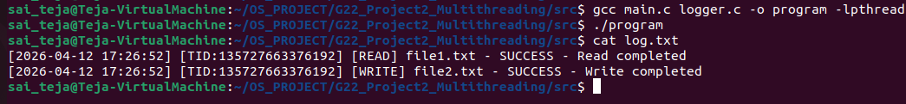

# Multithreaded File Management System

## Objective

To implement a multithreaded file management system in C using POSIX threads ("pthreads") with focus on thread-safe logging.

---

Features Implemented (Current Work)

- Thread-safe Logging System
- Basic Multithreaded Execution
- Log generation with thread ID and timestamp

---

## Project Structure

G22_Project2_Multithreading/
├── src/
│   ├── main.c
│   ├── logger.c
│   ├── logger.h
├── docs/
│   └── documentation.md

---

## Logging System

- Implemented using "pthread_mutex"
- Ensures safe logging from multiple threads

Log Format:

[YYYY-MM-DD HH:MM:SS] [TID] [OPERATION] filename - status - details

Example:

[2026-04-12 14:39:44] [TID:12345] [READ] file1.txt - SUCCESS - Read completed

---

## Thread Model

- Threads created using "pthread_create()"
- Each thread performs an operation and logs output

---

## Build & Run

cd src
gcc main.c logger.c -o program -lpthread
./program

---

## Contribution

Sai Teja

- Implemented "logger.c" and "logger.h"
- Designed thread-safe logging mechanism using mutex
- Integrated logging into multithreaded execution

---

## Conclusion

This module demonstrates safe logging in a multithreaded environment and forms the base for integrating other file operations.

---

## Execution Screenshot

Program Execution

### output

---

## Description

The above screenshot shows the execution of the multithreaded program where multiple threads perform operations and logs are generated successfully.

Each log entry contains:

- Timestamp
- Thread ID
- Operation type
- Status of execution

This verifies that the logging system works correctly in a multithreaded environment.
